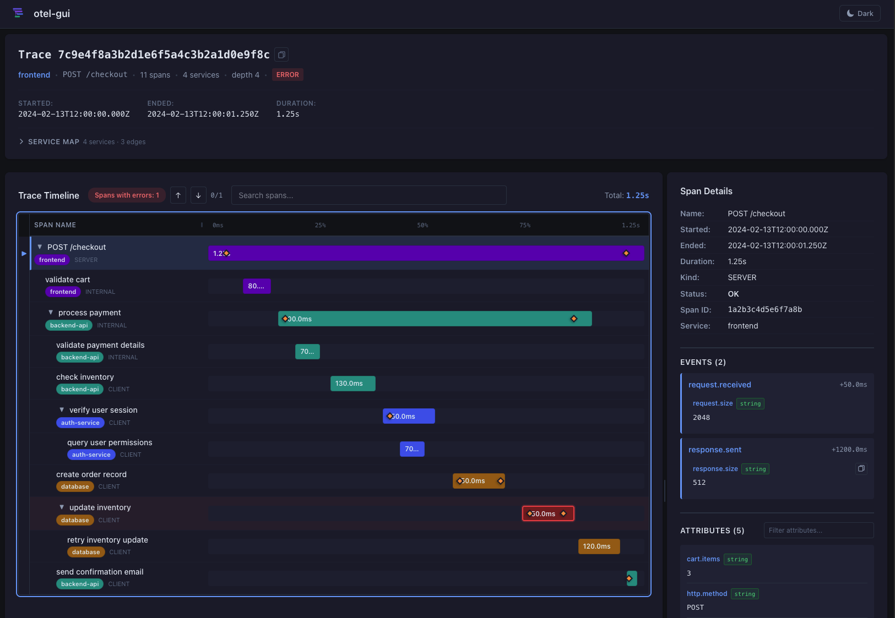
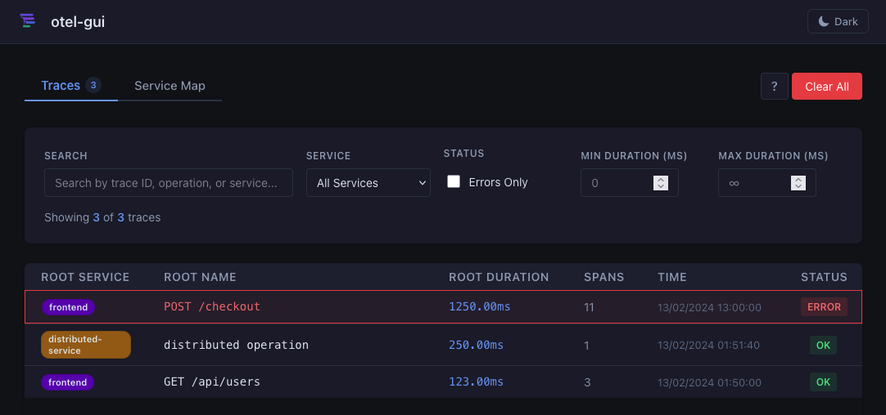
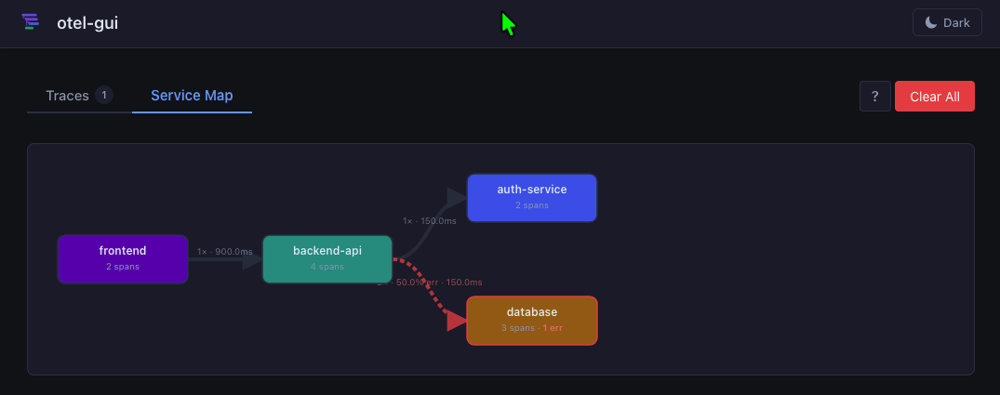
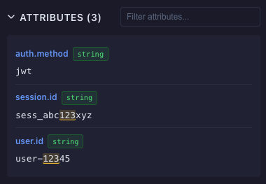
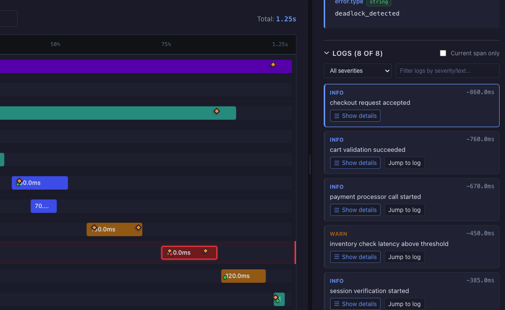

# otel-gui

A lightweight, zero-config OpenTelemetry trace viewer for local development.

Drop-in replacement for a collector endpoint — point your OTLP exporter at it and see traces immediately. No database required.



## ✨ Features

- **Zero config** — listens on port 4318, the standard OTLP/HTTP port. Most exporters work without changing a single setting
- **OTLP JSON & Protobuf** — accepts both `application/json` and `application/x-protobuf` payloads
- **Real-time updates** — new traces appear instantly via SSE (Server-Sent Events), no polling
- **Waterfall timeline** — Honeycomb-style span waterfall with resizable name column and sidebar
- **Service map** — auto-generated graph of cross-service calls with error rates and latency (p50/p99)
- **Search & filter** — filter trace list by text, service, status, and duration range; search spans inside a trace based on attributes, events, and span name and id
- **Keyboard navigation** — rich keyboard control: arrow keys for the span tree, `/` to search, `m` to toggle service map, escape key to clear search and go back to the trace list, `?` for shortcuts help
- **Error navigation** — jump between error spans with one key
- **Span details** — attributes, events with timeline markers, resource attributes, instrumentation scope, span links, correlated logs
- **Collapse/expand** — hide subtrees in the waterfall for cleaner viewing
- **Resizable panels** — drag splitters to resize the waterfall name column and the span details sidebar
- **Dark mode** — toggle between light and dark themes
- **Incremental ingestion** — spans from the same trace can arrive in separate requests and out of order; the store merges them correctly
- **In-memory with optional local persistence** — default is in-memory only; opt into PGlite-backed restart recovery with bounded retention

## 📸 Screenshots

### Trace list & filters



### Service map



### Trace detail — waterfall & span sidebar


### Search highlighting



### Correlated logs



## 🛠️ Quick Start

**Requires**: Node.js ≥ 20, [pnpm](https://pnpm.io)

```sh
git clone https://github.com/metafab/otel-gui
cd otel-gui
pnpm install
pnpm dev
```

### Development commands

```sh
pnpm run dev        # Start dev server on port 4318
pnpm run lint       # Lint TypeScript, JavaScript, and Svelte files
pnpm run format     # Format files with Prettier
pnpm run format:check # Check formatting without writing changes
pnpm run check      # TypeScript type-check
pnpm run test       # Run unit tests (Vitest)
pnpm run test:watch # Tests in watch mode
pnpm run build      # Production build
```

Open [http://localhost:4318](http://localhost:4318) — the OTLP endpoint is live at the same address.

### Docker 🐳

Pull and run the published GHCR image:

```sh
docker pull ghcr.io/metafab/otel-gui:latest
docker run --rm --name otel-gui -p 4318:4318 ghcr.io/metafab/otel-gui:latest
```

Container tags are published from Git refs:

- `latest` for the default branch
- `v*` tags (for example, `v1.1.0`)
- `sha-<commit>` immutable tags

Build and run locally with Docker:

```sh
docker build -t otel-gui .
docker run --rm -p 4318:4318 otel-gui
```

Then use the standard OTLP endpoint:

```sh
export OTEL_EXPORTER_OTLP_ENDPOINT=http://localhost:4318
```

#### Docker port configuration

The container reads `PORT` (default `4318`). You can override it at runtime:

```sh
docker run --rm -e PORT=55681 -p 55681:55681 otel-gui
```

Using port `4318` is recommended for zero-config OTLP exporters.

#### Docker Compose

Run with Docker Compose:

```sh
docker compose up --build
```

Run in background:

```sh
docker compose up -d --build
```

Stop:

```sh
docker compose down
```

To use a different port:

```sh
PORT=55681 docker compose up --build
```

### Sending Traces

Point any OpenTelemetry SDK exporter at the viewer:

```sh
export OTEL_EXPORTER_OTLP_ENDPOINT=http://localhost:4318
```

No other configuration needed. The viewer accepts the standard `POST /v1/traces` endpoint.

Requests with `Content-Encoding: gzip` are also supported.

### Sending Logs

The viewer also accepts OTLP logs at:

```sh
POST /v1/logs
```

Use the same `traceId`/`spanId` values as your spans to get correlated logs in trace detail sidebar.

### Try the demo

Run the bundled e-commerce demo to see all features immediately:

```sh
./demo-ecommerce-trace.sh
```

This sends a realistic multi-service trace (frontend → backend-api → auth-service + database) with errors, retries, and incremental span arrival across two requests.

### Manual curl examples

```sh
# Simple 3-span trace
curl -X POST http://localhost:4318/v1/traces \
  -H "Content-Type: application/json" \
  -d @samples/sample-trace.json

# Correlated logs for the simple trace
curl -X POST http://localhost:4318/v1/logs \
  -H "Content-Type: application/json" \
  -d @samples/sample-log.json

# E-commerce trace — part 1 (frontend + backend-api)
curl -X POST http://localhost:4318/v1/traces \
  -H "Content-Type: application/json" \
  -d @samples/sample-trace-ecommerce-part1.json

# E-commerce correlated logs — part 1
curl -X POST http://localhost:4318/v1/logs \
  -H "Content-Type: application/json" \
  -d @samples/sample-log-ecommerce-part1.json

# E-commerce trace — part 2 (auth-service + database with errors)
curl -X POST http://localhost:4318/v1/traces \
  -H "Content-Type: application/json" \
  -d @samples/sample-trace-ecommerce-part2.json

# E-commerce correlated logs — part 2
curl -X POST http://localhost:4318/v1/logs \
  -H "Content-Type: application/json" \
  -d @samples/sample-log-ecommerce-part2.json

# Trace with error spans (status.code = 2)
curl -X POST http://localhost:4318/v1/traces \
  -H "Content-Type: application/json" \
  -d @samples/sample-trace-error.json

# Trace with span links
curl -X POST http://localhost:4318/v1/traces \
  -H "Content-Type: application/json" \
  -d @samples/sample-trace-links.json
```

See [SAMPLE_TRACES.md](./samples/SAMPLE_TRACES.md) for a full feature exploration guide.

## ⚙️ Configuration

| Variable                              | Default            | Description                                                                                                                                                                                                                                                                     |
| ------------------------------------- | ------------------ | ------------------------------------------------------------------------------------------------------------------------------------------------------------------------------------------------------------------------------------------------------------------------------- |
| `PORT`                                | `4318`             | HTTP port the server listens on                                                                                                                                                                                                                                                 |
| `OTEL_GUI_MAX_TRACES`                 | `1000`             | Maximum number of traces kept in memory (1–10 000). Oldest traces are evicted first when the limit is reached. Requires a restart.                                                                                                                                              |
| `OTEL_GUI_PERSISTENCE_MODE`           | `memory`           | Persistence backend mode. Use `memory` (default, no disk writes) or `pglite` (requires an external backend module, typically enterprise).                                                                                                                                       |
| `OTEL_GUI_PERSISTENCE_PATH`           | `.otel-gui/pglite` | Directory path for local PGlite data when persistence mode is `pglite`.                                                                                                                                                                                                         |
| `OTEL_GUI_PERSISTENCE_FLUSH_MS`       | `750`              | Debounce interval for batched persistence flushes in milliseconds (50–60000).                                                                                                                                                                                                   |
| `OTEL_GUI_PERSISTENCE_BACKEND_MODULE` | _(empty)_          | Optional module id/path dynamically loaded at startup to register persistence backends. Relative file paths resolve from the `otel-gui` project root (examples: `@otel-gui/enterprise-persistence/register`, `../otel-gui-enterprise/enterprise-persistence/dist/register.js`). |
| `OTEL_GUI_LICENSE_KEY`                | _(empty)_          | Optional enterprise license key consumed by private persistence backend modules.                                                                                                                                                                                                |
| `OTEL_GUI_LICENSE_PUBLIC_KEY_PATH`    | _(empty)_          | Optional filesystem path to the PEM-encoded public key used by enterprise modules for offline license verification.                                                                                                                                                             |

Copy [`.env.example`](./.env.example) to `.env` to customize:

```sh
cp .env.example .env
# then edit .env
```

For external backend registration details, see [`docs/enterprise-persistence-module.md`](./docs/enterprise-persistence-module.md).

When `OTEL_GUI_PERSISTENCE_MODE=pglite` falls back to memory, check `GET /api/config` -> `persistence.unavailableReason` for a precise cause.

## 🏗️ Building

```sh
pnpm build
PORT=4318 node build
```

The production build uses `@sveltejs/adapter-node`. In-memory state is kept alive by the Node.js process — no external store required for local use.

In Docker, traces are still in-memory only and are lost when the container stops.

## ⌨️ Keyboard Shortcuts

| Key              | Where        | Action                          |
| ---------------- | ------------ | ------------------------------- |
| `/`              | Everywhere   | Focus search                    |
| `Esc`            | Everywhere   | Clear search / go back          |
| `m`              | Everywhere   | Toggle Traces / Service Map tab |
| `Alt+Backspace`  | Trace list   | Clear all traces                |
| `↑↓←→` / `Enter` | Trace detail | Navigate span tree              |
| `n` / `N`        | Trace detail | Next / prev search match        |
| `e` / `E`        | Trace detail | Next / prev error span          |
| `?`              | Everywhere   | Toggle shortcuts overlay        |

## 📐 Architecture

```
POST /v1/traces          ← OTLP receiver (JSON + Protobuf)
POST /v1/logs            ← OTLP logs receiver (JSON + Protobuf)
GET  /api/traces         ← trace list for the UI
GET  /api/traces/:id     ← single trace
GET  /api/traces/:id/logs ← trace-scoped correlated logs
GET  /api/traces/stream  ← SSE stream (real-time push)
GET  /api/service-map    ← aggregated service graph
```

Server-only state lives in `src/lib/server/traceStore.ts` with swappable backends behind the `TraceStore` interface. In default `memory` mode, runtime state is kept in memory with FIFO eviction. The retention limit defaults to 1000 traces and is configurable via `OTEL_GUI_MAX_TRACES`.
<br />
SSE subscribers are notified on every write and receive a debounced `event: traces` message.
<br />
Additional persistence backends (including `pglite`) are loaded via `OTEL_GUI_PERSISTENCE_BACKEND_MODULE` and can be distributed separately (for example in an enterprise package).

## 💠 Tech Stack

- [SvelteKit 5](https://kit.svelte.dev) with Svelte 5 runes (`$state`, `$derived`, `$effect`)
- [`@sveltejs/adapter-node`](https://kit.svelte.dev/docs/adapter-node) for persistent in-memory state
- [`protobufjs`](https://github.com/protobufjs/protobuf.js) for Protobuf decoding
- No UI library — custom waterfall, service map SVG, and all components from scratch
- TypeScript throughout

## 🤝 Contributing

You can [submit a new idea](https://github.com/metafab/otel-gui/issues/new).

And of course, you can develop an existing or a new idea 😀:

1. Fork the repository
2. Create a feature branch (`git checkout -b feature/amazing-feature`)
3. Make your changes and add tests if applicable
4. Run `pnpm run lint && pnpm run format:check && pnpm run check && pnpm run test` to validate
5. Commit your changes (`git commit -m 'Add amazing feature'`)
6. Push to the branch (`git push origin feature/amazing-feature`)
7. Open a Pull Request

## 📄 License

This project is open source. See the [LICENSE](./LICENSE) file for details.
