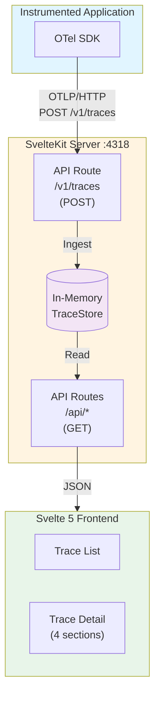

# Implementation Plan: otel-gui

A lightweight, local OpenTelemetry trace viewer inspired by Honeycomb's trace detail UI.
`otel-gui` is a **local-first debugging tool** for OpenTelemetry during development.
It optimizes the shortest path from "app emits telemetry" to "developer understands the issue" on localhost.

## Tech Stack

| Layer          | Choice                             | Rationale                                                                 |
| -------------- | ---------------------------------- | ------------------------------------------------------------------------- |
| Framework      | SvelteKit 5 (Svelte 5 runes)       | User preference. Full-stack TypeScript. Fast, lightweight.                |
| Adapter        | `@sveltejs/adapter-node`           | Required for persistent in-memory state and SSE support.                  |
| Language       | TypeScript                         | Full-stack type safety.                                                   |
| Storage        | In-memory (`Map`) behind interface | Simplest for v1. Swappable to SQLite via same interface.                  |
| OTLP format    | JSON and Protobuf                  | Both `application/json` and `application/x-protobuf` supported.           |
| OTLP transport | HTTP first (`:4318`)               | Lowest-friction local setup; gRPC can be added later if demand is proven. |
| Real-time      | SSE (`EventSource`)                | Single persistent connection, instant push on ingest.                     |
| Port           | 4318                               | Standard OTLP/HTTP port — zero config on exporter side.                   |
| Visualization  | Custom HTML/CSS waterfall          | Industry standard approach (Honeycomb, Jaeger all do this).               |

## Architecture



## File Structure

```
src/
├── lib/
│   ├── types.ts                          # TypeScript types (StoredSpan, StoredTrace, etc.)
│   ├── server/
│   │   ├── traceStore.ts                 # In-memory TraceStore (server-only)
│   │   └── protobuf.ts                   # Protobuf decoder for OTLP traces
│   ├── utils/
│   │   ├── attributes.ts                 # flattenAttributes(), extractAnyValue()
│   │   ├── time.ts                       # formatDuration(), formatTimestamp()
│   │   ├── spans.ts                      # spanKindLabel(), statusLabel(), buildSpanTree()
│   │   └── colors.ts                     # Service name → color palette
│   ├── stores/
│   │   └── traces.svelte.ts              # Client-side reactive store (SSE)
│   └── components/
│       ├── TraceIdentification.svelte    # Section 1: top bar
│       ├── TraceSummary.svelte           # Section 2: collapsible minimap
│       ├── TraceWaterfall.svelte         # Section 3: waterfall container
│       ├── WaterfallRow.svelte           # Individual span row in waterfall
│       └── SpanSidebar.svelte            # Section 4: span detail sidebar
├── routes/
│   ├── +page.svelte                      # Trace list page
│   ├── +layout.svelte                    # App layout
│   ├── v1/
│   │   └── traces/
│   │       └── +server.ts                # OTLP receiver endpoint
│   ├── api/
│   │   └── traces/
│   │       ├── +server.ts                # GET /api/traces (list), DELETE (clear)
│   │       ├── stream/
│   │       │   └── +server.ts            # GET /api/traces/stream (SSE)
│   │       └── [traceId]/
│   │           └── +server.ts            # GET /api/traces/:id (detail)
│   └── traces/
│       └── [traceId]/
│           ├── +page.ts                  # Load function
│           └── +page.svelte              # Trace detail page
└── app.html
```

## v2 Product Contract & Guardrails

v2 focuses on **traces + lightweight correlated logs** for fast local debugging, not on becoming a full observability platform.

### Scope

- **Primary scope**: traces + lightweight, trace-correlated logs for local debugging and root-cause analysis
- **Deployment model**: single local process, no required external backend
- **Default behavior**: ephemeral in-memory state
- **State option**: optional local persistence mode (opt-in only)
- **Design principle**: fast startup, low friction, minimal setup

### Explicit Non-Goals

- Not a full observability suite (no enterprise dashboards/alerting/policy engine)
- Not a production-scale telemetry backend or long-term retention system
- Not a managed cloud competitor to Honeycomb/Datadog/New Relic/Grafana Cloud/Sematext
- Not a "collect everything forever" platform (bounded local storage remains required)
- Not replacing existing collector/backends in production environments

### Success Metrics

These metrics are the acceptance criteria for v2 usability and performance.

| Metric             | Definition                                                                                                      | v2 Target          |
| ------------------ | --------------------------------------------------------------------------------------------------------------- | ------------------ |
| Time to root cause | Median time from first trace appearance in UI to identifying likely failing span/service (local debugging task) | **≤ 5 min (p50)**  |
| Setup time         | Time from fresh clone to receiving first trace in UI (`pnpm install && pnpm dev` + standard OTLP endpoint)      | **≤ 10 min**       |
| Memory footprint   | Server RSS (Resident Set Size) while handling the max in-memory window (1,000 traces) in normal interactive use | **≤ 300 MB (p95)** |
| Startup latency    | Time from running `pnpm dev` to OTLP endpoint and UI being usable on localhost                                  | **≤ 5 s (p95)**    |

### Metric Measurement Guardrails

- Use a documented local benchmark script and repeatable fixture set.
- Publish machine profile (CPU/RAM/OS/Node version) with each benchmark run.
- Track trends across releases; regressions beyond 10% require explicit sign-off.

## OTLP/gRPC Positioning

### Current Decision (v2)

- Keep OTLP/HTTP (`/v1/traces` on `:4318`) as the default and primary ingestion path.
- Do not include OTLP/gRPC (`:4317`) in baseline v2 scope.
- Optimize for local debugging speed, minimal configuration, and low runtime complexity.

### Why HTTP-first remains the default

- **Developer experience**: `:4318` aligns with standard OTLP/HTTP and preserves the zero-config local path.
- **Operational simplicity**: avoids HTTP/2 server lifecycle and additional transport-specific failure modes.
- **Maintenance cost**: keeps implementation, testing, and support surface focused on core trace-debugging UX.
- **Product fit**: current contract is local-first debugging, not broad collector/backend replacement.

### When gRPC becomes justified

Add OTLP/gRPC support once there is repeated, validated demand from users who cannot reasonably switch exporters to HTTP, for example:

- frequent setup failures caused by gRPC-only defaults in target environments,
- enterprise constraints that mandate gRPC transport,
- measurable onboarding friction attributable to missing `:4317` support.

### Proposed rollout approach

1. **Phase 1 (default)**: HTTP-only remains canonical.
2. **Phase 2 (optional)**: Add gRPC receiver behind a feature flag / optional module.
3. **Phase 3 (stabilize)**: Expand interoperability and reliability tests before considering broader default usage.

## Maybe Later

### OTLP/gRPC Receiver (`:4317`)

If implemented, keep this explicitly optional and additive:

- Preserve OTLP/HTTP (`:4318`) as the default path.
- Add gRPC only when demand thresholds in **When gRPC becomes justified** are met.
- Isolate implementation behind a transport boundary so store/API/UI remain unchanged.
- Gate with a runtime flag or optional module to avoid increasing baseline complexity.

### Docker Hub Mirroring

Optional Docker Hub mirroring is available via GitHub Actions and is disabled by default. To enable it, set these repository secrets:

- `DOCKERHUB_USERNAME`
- `DOCKERHUB_TOKEN`
- `DOCKERHUB_REPOSITORY` (for example, `metafab/otel-gui`)

### Trace Summary (`TraceSummary.svelte`)

- Collapsible via caret toggle
- Condensed horizontal bar chart: up to 6 rows (one per tree depth level)
- Each row: bars sized proportionally to span duration relative to total trace duration
- Bars color-coded by `service.name`
- Hover: tooltip with span name
- Click bar: scroll to and highlight that span in the waterfall below
- Error highlighting toggle: error spans tinted red

---

## Key Design Decisions

1. **JSON and Protobuf OTLP support**: Both `application/json` and `application/x-protobuf` formats are supported using `protobufjs` with vendored `.proto` files from the OpenTelemetry specification. Byte fields (traceId, spanId) are automatically converted from base64 to hex to match OTLP JSON format.

2. **SSE over polling**: `EventSource` provides instant push on ingest with zero client-side interval management. The server endpoint debounces rapid batched exports (100 ms), sends a heartbeat every 30 s to keep proxies alive, and uses `traceStore.subscribe()` for decoupled notification. The `EventSource` API auto-reconnects on drop.

3. **Custom waterfall over charting library**: No suitable off-the-shelf Svelte trace/gantt component exists. All serious trace viewers build custom waterfalls with CSS-positioned divs.

4. **Port 4318**: Standard OTLP/HTTP port means instrumented apps can point at the viewer with zero config change — just set `OTEL_EXPORTER_OTLP_ENDPOINT=http://localhost:4318`.

5. **`$state.raw` for trace lists**: Svelte 5's `$state()` deeply proxies objects, which is expensive for large arrays of spans that are replaced wholesale. `$state.raw()` avoids this overhead.

6. **Honeycomb's 4-section layout from day 1**: Even for a simple v1, structuring the detail view into identification / summary / waterfall / sidebar gives a clean, extensible foundation. Some sections (like the summary minimap) can start simple and grow richer.

7. **`service.name` as default color dimension**: Honeycomb defaults to this too. It's the most useful visual cue in multi-service traces.

8. **Store interface for swappable storage**: The `TraceStore` interface allows dropping in SQLite later without touching API routes or frontend code.

9. **Keyboard shortcuts follow web conventions**: `/` to focus search (GitHub/YouTube pattern), `n`/`Shift+N` for next/previous match (browser devtools pattern), `e`/`Shift+E` for error navigation, `Esc` for contextual dismiss/back, `Alt/⌥+Delete` for destructive clear (no browser conflicts, hard to hit accidentally), `?` for help overlay. All shortcuts guard against firing when focus is inside an input. The `?` overlay uses the same modal pattern as the attribute fullscreen viewer.

10. **gRPC is demand-driven, not baseline**: OTLP/gRPC (`:4317`) is intentionally deferred from baseline v2 to protect local-first simplicity and maintain velocity. It remains a candidate as an optional transport when user demand justifies the extra complexity.
